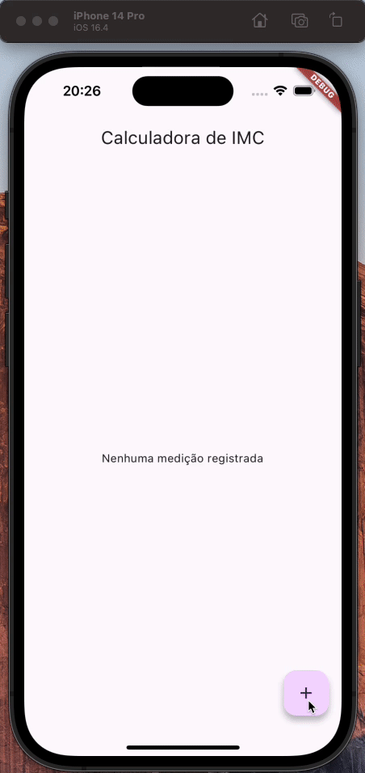

# Aprimorando a sua Calculadora de IMC com Flutter

Este repositório contém o código referente ao desafio "Aprimorando a sua Calculadora de IMC com Flutter", do Santander Bootcamp 2023 - Mobile com Flutter

Consiste na evolução do desafio anterior, uma calculadora de IMC feita puramente em Dart.

## Demonstração

## Pacotes utilizados

- [intl](https://pub.dev/packages/intl): pacote que traz recursos de internacionalização. Usado especificamente para formatação de números e datas;
- [hive](https://pub.dev/packages/hive): pacote que traz recursos de armazenamento local de dados;
- [equatable](https://pub.dev/packages/equatable): pacote que permite a comparação de objetos em Dart, sendo uma alternativa mais simples à sobrescrita do operador `==`;
- [get_it](https://pub.dev/packages/get_it): Service Locator que facilita a Injeção de Dependências nas aplicações.
